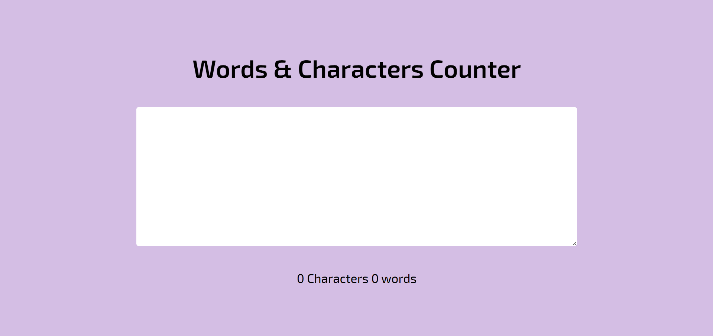

# Word Counter



A simple and interactive **Word and Character Counter** web app. This tool counts the characters and words in real-time as the user types into a text area. The project includes responsive HTML, CSS for a clean design, and JavaScript for counting logic.

## Features

- **Real-time Counting**: Counts both words and characters as the user types.
- **Dynamic Display**: Updates word and character count live on the screen.
- **Responsive Design**: Styled with CSS to look great on various screen sizes.

## Technologies Used

- **HTML** for structure
- **CSS** for styling and responsive design
- **JavaScript** for functionality

## Getting Started

1. Clone the repository:
   ```bash
   git clone https://github.com/yourusername/word-counter.git
   ```
2. Navigate into the project directory:

```
   cd word-counter
```

3. Open index.html in your browser to see the word counter in action.

## How It Works

The JavaScript code listens for the keypress event on the text area:

Characters Count: Updates dynamically based on the length of the input text.
Words Count: Counts words based on spaces between them, trimming extra spaces.

## Contact

Feel free to reach out if you have any questions or suggestions!

- [Website](https://adityadhiman.in)
- [GitHub](https://github.com/adityadhiman-in)
- [LinkedIn](https://www.linkedin.com/in/adityadhiman-in)

Made with ❤️ by [Aditya Dhiman](https://adityadhiman.in)
